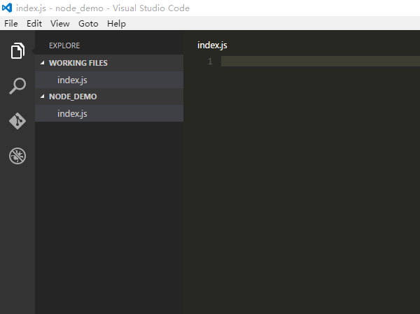
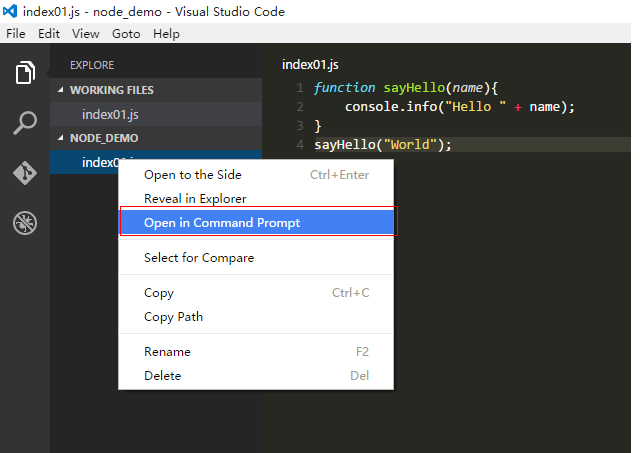
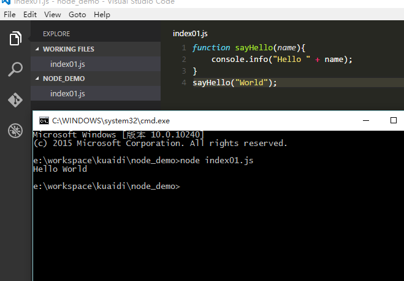
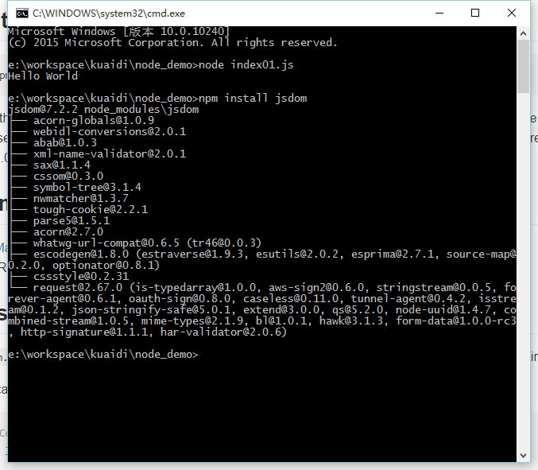

# family_together
-------------------------------------
## nodejs开发流程
* 安装nodejs,npm等开发环境；
* 安装开发工具（IDE），推荐使用[vscode](https://code.visualstudio.com/ "vscode")；
* 启动开发工具，如下图    
	
* 新建一个文件index01.js，加入如下代码     
````javascript   
function sayHello(name){   
	console.info("Hello " + name);   
}   
sayHello("World");   
````
* 打开命令行，执行命令node index01.js   
	     
	
## npm包管理
NPM，Node Package Management, 是一款nodejs的包管理工具。     
常用的命令有 npm start, npm install, npm init等
## 抓取样例
* 安装包    
	npm install jsdom       
	    
* 编写js文档
* 执行
	
